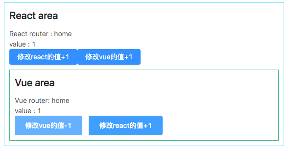

# Stitches

React and Vue mixed development.

## Demo



## Usage

### Vue in React

```jsx
import React from 'react';
import Vue from 'vue'
import VueApp from './Index.vue'
import Converter from '../../components/converter.jsx'

export default _ => {
  return <Converter component={VueApp}/>
}
```

### React in Vue

```html
<template>
  <Converter :component="ReactApp"/>
</template>
<script>

import ReactApp from './reactApp.js'
import Converter from './converter.js'

export default {
  components: {
    Converter
  },
  data () {
    return {
      ReactApp
    }
  }
}
</script>
```

## Development

```bash
npm i
npm run dev
```
